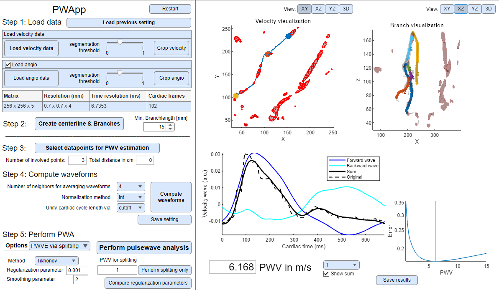
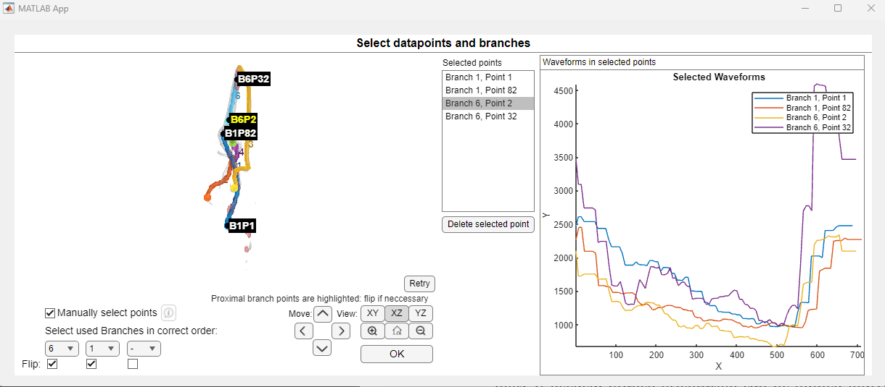

# Summary

The PWApp is a MATLAB software package enabling scientific research involving pulse
wave velocity (PWV) estimation from MRI-based 2D or 4D blood flow velocity data. A
graphical user interface simplifies investigations regarding PWV estimation and enables
proper comparison and testing of state-of-the-art and novel methods for MRI flow-data
based PWV estimation.

# Statement of need

The PWV is a well-studied parameter in medicine, known to correlate with aging and neuro-degenerative diseases [@Li:2004; @GillerAasli:1994;@RabbenStergiopulosHellevikSmisethSloerdahlUrheimAngelsen:2004; @VulliemozStergiopulosMeuli:2002]. Due to its potential as a biomarker for early diagnosis of such conditions, accurate measurement of the PWV has garnered significant interest [@DarwichLangevinDarwich:2015; @VossDykeBallonGupta:2019;@TangLeeChuangHuang:2020]. However, due to its high magnitude, the PWV is currently not directly measurable with MRI techniques [@RingelsteinKahlscheuerNiggemeyerOtis:1990]. Hence, several methods have been proposed for its calculation, which are based on blood flow data obtained in magnetic resonance imaging (MRI), the transit-time of the pulse wave [@Markl:2010; @FieldenFornwaltJeroschHeroldEisnerStillmanOshinski:2008; @BargiotasMousseauxYuVenkateshBollacheCesareLimaRedheuilKachenoura:2015], a maximum-likelihood estimator [@BjoernfotGarpebringQvarlanderMalmEklundWaahlin:2021], or on inverse problems approaches [@HubmerNeubauerRamlauVoss:2020;@HubmerNeubauerRamlauVoss:2018;@WeissingerHubmerRamlauVoss:2025].

The MATLAB-based PWApp enables PWV estimation with all of these types of methods within a uniform environment, which includes the preparation of MRI-based data, selection of involved data-points, and segmentation of the data into flowing and non-flowing parts and data normalization. Furthermore, the (pulse-)wave describing the blood flow velocity along an intracranial artery consists of a forward (anterograde) and a backward (retrograde, reflected) part, but measurements of this wave usually consist of a superposition

of these components \[@VossDykeBallonGupta:2019]. However, common methods for PWV-estimation usually do not consider the backwards wave, a gap which was closed in \[@WeissingerHubmerRamlauVoss:2025]. An additional motivation for the PWApp is to provide a user-friendly tool which incorporates this method for PWV estimation and pulse wave splitting as well.

# Description of the App

The app layout is shown in Figure \\autoref{fig:mainlayout}. The main window is separated into two panels:

- **Options panel (left)**: for input settings, parameters, and actions
- **Visualization panel (right)**: for displaying outputs, previews, and results

To perform a complete PWV estimation from raw MRI data, the app follows a structured five-step workflow which has to be completed in order. The steps are:

1. **Data loading**
2. **Centerline extraction and branch identification**
3. **Data-point selection**
4. **Waveform computation**
5. **PWV estimation**

These steps are described in general below, and in detail in the PWApp [manual](https://github.com/weisslu/PWApp).

### Step 1: Load flow MRI data

PWApp supports both 2D and 4D flow MRI data. Due to variability in metadata and  data-formats across scanners and imaging methods, data must be loaded via a user-defined MATLAB script. This script must return the variables required for the further processing of the data, as specified in the PWApp \[manual](https://github.com/weisslu/PWApp). After loading, the app automatically segments the data into flowing and non-flowing voxels using an approach based on [@AndersonJohnsonBockMarklWieben:2008]. Optionally, a 3D angiogram can be loaded to assist with arterial length computation, in particular when flow data only partially covers the artery segments of interest, or if high-resolution length estimation is desirable. This angiogram data is again loaded via a custom script, which must return the variables listed in the [manual](https://github.com/weisslu/PWApp).

### Step 2: Centerline extraction and branch identification

A centerline is computed for the segmented artery data. This step also separates the artery into individual branches. If a 3D angiogram has been loaded, the centerline is computed based on this angiographic data. The used algorithm is based on [@EricSchrauben;SchraubenWaahlinAmbarkiSpaakMalmWiebenEklund:2015].

### Step 3: Select data-points for PWV estimation

Spatial points along the centerlines of specific branches can be selected manually; see Figure \autoref{fig:selectdatapoints}. Instead of selecting individual points, the user can also automatically select all available data points along a branch. Distances between selected points are computed using a Bezier-curve approximation (De Casteljau's algorithm, see [@Farin:2000]). This achieves sub-pixel accuracy and mimics the natural curvature of arteries.

### Step 4: Compute waveforms

The partial voluming effect (see [@RoellColchesterSummersGriffin:1994]) might reduce the amplitude of flow waveforms. Therefore, preprocessing of the waveforms is required before PWV-estimation. Commonly, the measured blood flow velocity data is used to compute flow waveforms along several artery cross-sections. However, if the number of voxels spanning over the cross-section is rather small, the flow signal may become noisy or inaccurate. To mitigate this, we propose normalization instead. Due to the continuity equation, the total flow over time should be constant in each cross-section of a (non-branching) artery. This can be achieved with $L^1$-normalization, which is implemented in the PWApp.

### Step 5: Perform PWV estimation

The PWApp features five different methods for PWV-estimation: Time-to-Foot (TTF) [@Markl:2010], Cross-Correlation [@FieldenFornwaltJeroschHeroldEisnerStillmanOshinski:2008], Wavelet [@BargiotasMousseauxYuVenkateshBollacheCesareLimaRedheuilKachenoura:2015], Maximum Likelihood Estimation [@BjoernfotGarpebringQvarlanderMalmEklundWaahlin:2021], and Pulse Wave Splitting (Inverse Problem Approach) [@WeissingerHubmerRamlauVoss:2025]. Each of these methods is explained in more detail in the PWApp [manual](https://github.com/weisslu/PWApp).

An example dataset is accessible in the repository at `PWApp/example/flow_dicoms` and optionally `PWApp/example/angio_dicoms`, which can be loaded via the provided scripts `PWApp/example/read_dicoms.m` and `PWApp/example/read_angio_dicoms.m`, respectively.

# Disclaimer

This app is highly influenced by the [4D Flow PWV Tool](https://www.github.com/schrau24/4DFlowPWVTool) by Eric Schrauben [@EricSchrauben;@SchraubenWaahlinAmbarkiSpaakMalmWiebenEklund:2015]. HUV is an inventor on Cornell University patents related to this research.

# Acknowledgements

HUV acknowledges support from the Nancy M. and Samuel C. Fleming Research Scholar Award in Intercampus Collaborations, Cornell University. RR and SH were funded in part by the Austrian Science Fund (FWF) SFB 10.55776/F68 ``Tomography Across the Scales'', project F6805-N36 (Tomography in Astronomy). For open access purposes, the authors have applied a CC BY public copyright license to any author-accepted manuscript version arising from this submission. LW is partially supported by the State of Upper Austria.

# References

